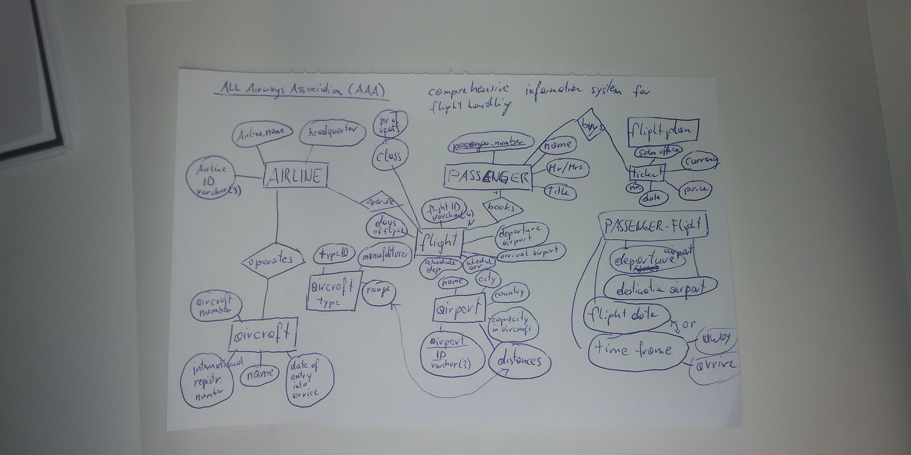
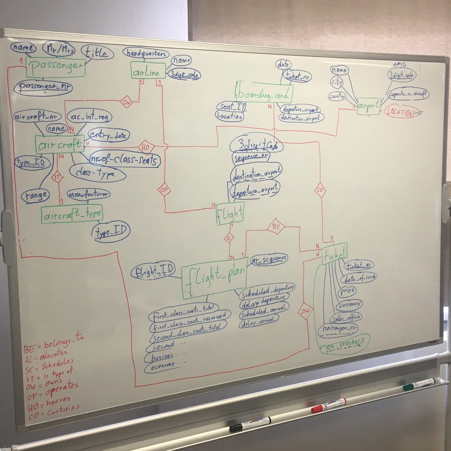
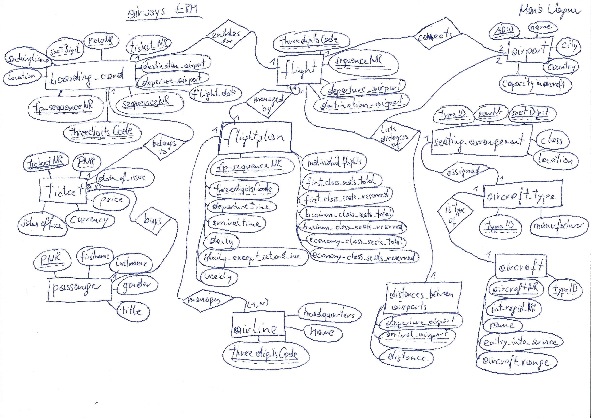
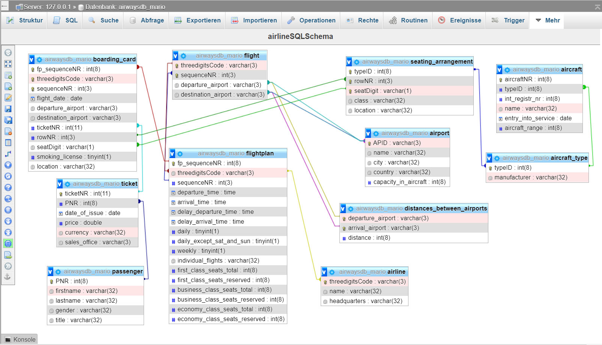

# AirwaysERM

The All Airways Association (AAA) is an association that brings together all airlines. 
This association plans to install a comprehensive information system for flight handling. 
An initial survey produces the following situation report:
When a passenger (passenger number, name, Mr/Mrs, title, etc.) wants to book a flight (or several), 
he or she first specifies the desired departure and destination airports, the desired flight date 
and possibly also a time frame when he or she wants to fly away or arrive.
There are various airlines (name, headquarters, etc.) that operate flights. Airlines are identified 
by a code of maximum three digits (e.g. PA for PanAm, FUA for Futura Air). Each airline operates 
aircraft (aircraft number, international registration number, name, date of entry into service, etc.) 
of different aircraft types (type identification, manufacturer, range, etc.).
The airports (name, city, country, capacity in aircraft, etc.) are also encrypted with a three-digit code 
(e.g. VIE for Vienna-Schwechat, JFK for New York - John F. Kennedy, IBZ for Ibiza). 
The distances between airports must be recorded in order to be able to take the range of 
the aircraft type into account when drawing up the flight plan.
Each flight has a departure airport and an arrival airport, the flights are numbered consecutively 
with a three-digit number within a company. (e.g. PA039 between VIE and JFK, FUA916 between IBZ and VIE) 
Each flight has a fixed scheduled departure and arrival time, and the days on which the flight takes 
place are also specified. (e.g. daily for scheduled flights, daily except Sat and Sun, weekly Mon, 
and the individual days for charter flights). The number of seats available in each class is 
determined in advance for each flight, the number of remaining free seats must also be determined 
on an ongoing basis. The flights booked by the passenger are summarized on one ticket (ticket number, 
date of issue, price, currency, sales office, etc.)
Before starting the flight, the passenger will be given a boarding card at the airport, on which in 
addition to the flight number, date, departure airport, destination airport and name of the passenger, 
the allocated seat (row as number, seat as letter, e.g. 18D) and a smoking or non-smoking license 
plate appears. The non-smoking seats are assigned on each flight starting from the front of the aircraft, 
the smoking seats starting from the rear. Seating arrangements depend on the type of aircraft on which 
the flight is performed. For each seat the class (First Class 1 Economy) and location (window, aisle, middle) 
are to hold on to.
For each flight, it must also be possible to record the actual take-off and landing time in order to be able 
to make evaluations of the punctuality of individual flights.

### first solution

#### Own ERM



#### Group ERM



### second solution

#### ERM



#### textual notation

passenger( **PNR**:int(8), firstname:varchar(32), lastname:varchar(32), gender:varchar(32), title:varchar(32))

airline( **3digitsCode**:varchar(3), name:varchar(32), headquarters:varchar(32))

aircraft( **aircraftNR**:int(8), *typeID*:int(8), int_registr_nr:int(8), name:varchar(32), entry_into_service:date, range:int(8))

aircraft_type( **typeID**:int(8), manufacturer:varchar(32))

airport( **APID**:varchar(3), name:varchar(32), city:varchar(32), country:varchar(32), capacity_in_aircraft:int(8))

distances_between_airports(*departure_airport*:varchar(3), *arrival_airport*:varchar(3), distance:int(8))

flight( **3digitsCode**:varchar(3),**sequenceNR**:int(3) , *departure_airport*:varchar(3), *destination_airport*:varchar(3))

flightplan(**fp_sequenceNR**:int(8), *3digitsCode*:varchar(3), *sequenceNR*:int(3), departure_time:timestamp, arrival_time:timestamp, delay_departure_time:timestamp 
delay_arrival_time:timestamp, daily:boolean, daily_except_sat_and_sun:boolean, weekly:boolean, individual_flights:varchar(32), 
first_class_seats_total:int(8), first_class_seats_reserved:int(8),business_class_seats_total:int(8), business_class_seats_reserved:int(8),
economy_class_seats_total:int(8), economy_class_seats_reserved:int(8))

ticket( **ticketNR**:int(11), *PNR*:int(8), date_of_issue:date, price:double, currency:varchar(32), *sales_office*:varchar(3))

boarding_card(**3digitsCode**:varchar(3),**sequenceNR**:int(3), flight_date:date,*departure_airport*:varchar(3), *destination_airport*:varchar(3),
*ticketNR*:int(11), *rowNR*:int(3),*seatDigit*:varchar(1), smoking_license:boolean, location:varchar(32))

seating_arrangement(**typeID**:int(8),**rowNR**:int(3),**seatDigit**:varchar(1), class:varchar(32), location:varchar(32))


#### SQL Schema

[Link SQL_file](airwaysdb_mario.sql)
```
CREATE TABLE passenger( PNR int(8), firstname varchar(32), lastname varchar(32), gender varchar(32), title varchar(32), PRIMARY KEY(PNR));

CREATE TABLE airline( threedigitsCode varchar(3), name varchar(32), headquarters varchar(32), PRIMARY KEY(threedigitsCode));

CREATE TABLE aircraft( aircraftNR int(8), typeID int(8), int_registr_nr int(8), name varchar(32), entry_into_service date, aircraft_range int(8), PRIMARY KEY(aircraftNR));
ALTER TABLE aircraft ADD FOREIGN KEY (typeID) REFERENCES aircraft_type(typeID) ON DELETE CASCADE
CREATE TABLE aircraft_type( typeID int(8), manufacturer varchar(32), PRIMARY KEY(typeID));

CREATE TABLE airport( APID varchar(3), name varchar(32), city varchar(32), country varchar(32), capacity_in_aircraft int(8), PRIMARY KEY(APID));

CREATE TABLE distances_between_airports( departure_airport varchar(3), arrival_airport varchar(3), distance int(8), PRIMARY KEY(departure_airport, arrival_airport));

CREATE TABLE flight( threedigitsCode varchar(3), sequenceNR int(3), departure_airport varchar(3), destination_airport varchar(3), PRIMARY KEY(threedigitsCode, sequenceNR));

CREATE TABLE flightplan( fp_sequenceNR int(8), threedigitsCode varchar(3), sequenceNR int(3), departure_time time, arrival_time time, delay_departure_time time, 
delay_arrival_time time, daily boolean, daily_except_sat_and_sun boolean, weekly boolean, individual_flights varchar(32), 
first_class_seats_total int(8), first_class_seats_reserved int(8),business_class_seats_total int(8), business_class_seats_reserved int(8),
economy_class_seats_total int(8), economy_class_seats_reserved int(8), PRIMARY KEY(fp_sequenceNR));

CREATE TABLE ticket( ticketNR int(11), PNR int(8), date_of_issue date, price double, currency varchar(32), sales_office varchar(3), PRIMARY KEY(ticketNR));

CREATE TABLE boarding_card( fp_sequenceNR int(8), threedigitsCode varchar(3), sequenceNR int(3), flight_date date, departure_airport varchar(3), destination_airport varchar(3),
 ticketNR int(11), rowNR int(3), seatDigit varchar(1), smoking_license boolean, location varchar(32), PRIMARY KEY(fp_sequenceNR, threedigitsCode, sequenceNR));

CREATE TABLE seating_arrangement( typeID int(8), rowNR int(3), seatDigit varchar(1), class varchar(32), location varchar(32), PRIMARY KEY( typeID, rowNR, seatDigit));
```

